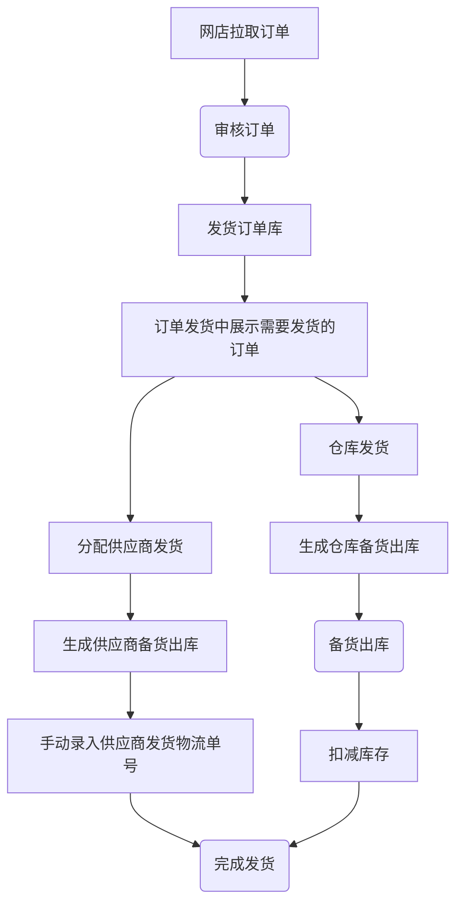
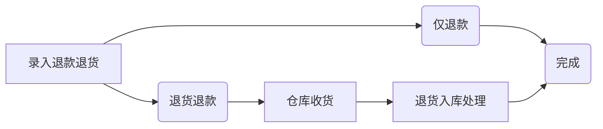
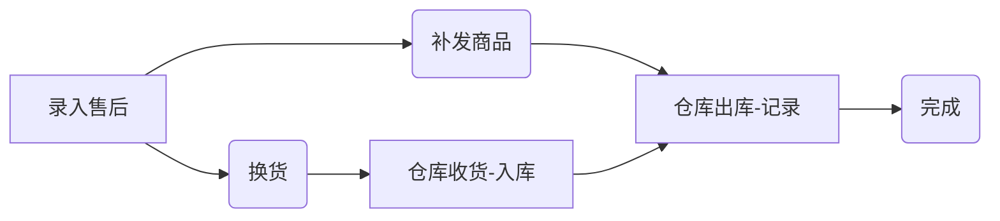
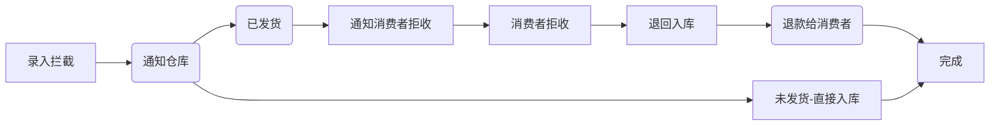
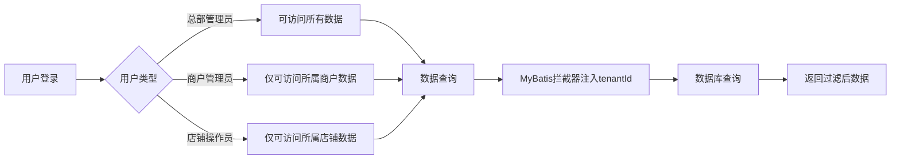

# 启航OMS 3.0 设计及架构文档

## 1. 概述

启航OMS 3.0是基于Spring Boot + Vue2的企业级订单管理系统，本次升级主要聚焦于多商户架构、自动化任务、统一数据结构等核心功能，提供完整的电商订单管理解决方案。

## 2. 技术栈

| 分类 | 技术 | 版本 |
|------|------|------|
| 后端框架 | Spring Boot | 2.7.x |
| 前端框架 | Vue.js | 2.x |
| 数据库 | MySQL | 8.0+ |
| ORM框架 | MyBatis Plus | 3.5.x |
| 定时任务 | Spring Scheduling | - |
| 前端UI | Element UI | 2.x |

## 3. 架构设计

### 3.1 整体架构

```
┌─────────────────────────────────────────────────────────────┐
│                     前端层 (Vue2)                            │
│  ┌─────────┐ ┌─────────┐ ┌─────────┐ ┌──────────────────┐   │
│  │ 商户管理 │ │ 订单管理 │ │ 发货管理 │ │   AI智能分析     │   │
│  └────┬────┘ └────┬────┘ └────┬────┘ └────────┬─────────┘   │
└───────┼───────────┼───────────┼───────────────┼─────────────┘
        │           │           │               │
        ▼           ▼           ▼               ▼
┌─────────────────────────────────────────────────────────────┐
│                     API网关层                               │
│              Spring Boot REST API                          │
└───────────────────────────┬─────────────────────────────────┘
                            │
        ┌───────────────────┼───────────────────┐
        ▼                   ▼                   ▼
┌───────────────┐   ┌───────────────┐   ┌───────────────┐
│   Service层   │   │   Service层   │   │   Service层   │
│ 业务逻辑处理   │   │ 业务逻辑处理   │   │ 业务逻辑处理   │
└───────┬───────┘   └───────┬───────┘   └───────┬───────┘
        │                   │                   │
        ▼                   ▼                   ▼
┌───────────────┐   ┌───────────────┐   ┌───────────────┐
│   Mapper层    │   │   Mapper层    │   │   Mapper层    │
│ 数据访问层    │   │ 数据访问层    │   │ 数据访问层    │
└───────┬───────┘   └───────┬───────┘   └───────┬───────┘
        │                   │                   │
        └───────────────────┼───────────────────┘
                            ▼
                    ┌─────────────┐
                    │   MySQL    │
                    │   数据库    │
                    └─────────────┘
```

### 3.2 模块划分

| 模块 | 职责 | 状态 |
|------|------|------|
| `api` | REST API控制层 | 新增/升级 |
| `core/common` | 公共工具类、枚举 | 升级 |
| `core/security` | 安全认证、权限管理 | 升级 |
| `service` | 业务逻辑层 | 新增/升级 |
| `mapper` | 数据访问层 | 新增/升级 |
| `model` | 数据模型定义 | 新增/升级 |
| `vue2` | 前端页面 | 新增/升级 |

## 4. 核心功能设计

### 4.1 多商户架构

#### 4.1.1 数据隔离机制

- **租户ID字段**：所有业务表通过 `merchant_id` 或 `tenant_id` 字段区分数据归属
- **MyBatis拦截器**：自动注入租户ID到SQL查询条件中
- **权限校验**：用户登录时获取所属商户/店铺，后续请求自动校验数据权限

#### 4.1.2 权限体系

| 用户类型 | userType | 权限范围 |
|----------|----------|----------|
| 总部管理员 | 0 | 所有数据 |
| 商户管理员 | 20 | 所属商户下所有店铺 |
| 店铺操作员 | 40 | 仅所属店铺 |

### 4.2 定时任务系统

#### 4.2.1 任务接口设计

```java
public interface IPollableService {
    void poll();
    default String getCronExpression() { return null; }
    default String getTaskName() { 
        return this.getClass().getSimpleName(); 
    }
}
```

#### 4.2.2 动态任务加载

系统支持动态加载定时任务，通过`SchedulingConfiguration`实现：
- 实现`IPollableService`接口的Bean会自动注册为定时任务
- 任务配置每10分钟自动刷新
- 支持通过`SysTask`表动态配置Cron表达式

### 4.3 功能模块总览

根据系统菜单结构，OMS3.0包含以下功能模块：

#### 4.3.1 商品管理模块

| 子功能 | 说明 |
|--------|------|
| 商品库管理 | 商品基础信息管理 |
| 供应商产品 | 供应商提供的产品管理 |
| 店铺商品管理 | 各店铺商品上架管理 |
| 商品分类管理 | 商品分类体系维护 |
| 商品品牌管理 | 品牌信息管理 |
| 供应商管理 | 供应商信息维护 |

#### 4.3.2 销售管理模块

| 子功能 | 说明 |
|--------|------|
| 订单库 | 所有订单的统一管理 |
| 店铺订单 | 各平台店铺订单管理 |
| 折扣管理 | 折扣活动配置 |

#### 4.3.3 发货管理模块

| 子功能 | 说明 |
|--------|------|
| 手动发货 | 手动录入物流信息完成发货 |
| 订单备货 | 订单备货准备 |
| 打单发货 | 电子面单打印发货 |
| 供应商发货 | 推送订单至供应商发货（钩子功能） |
| 云仓发货 | 推送订单至云仓发货（钩子功能） |
| 发货记录 | 发货历史记录查询 |
| 电子面单设置 | 电子面单配置 |
| 发货快递设置 | 快递模板配置 |

> **说明**：供应商发货和云仓发货模块主要作为ERP系统的钩子功能，提供基础的发货记录能力，引导用户使用ERP系统完成完整的发货流程。

#### 4.3.4 售后管理模块

| 子功能 | 说明 |
|--------|------|
| 订单售后库 | 售后订单统一管理 |
| 店铺售后 | 各店铺售后处理 |
| 售后台账 | 售后统计台账 |

#### 4.3.5 店铺管理模块

| 子功能 | 说明 |
|--------|------|
| 店铺管理 | 各平台店铺信息管理 |
| 商户管理 | 商户信息管理（多租户） |

#### 4.3.6 系统&接口配置模块

| 子功能 | 说明 |
|--------|------|
| 电商平台开关 | 各电商平台的启用/禁用控制 |
| 接口授权 | 平台API授权配置（OAuth等） |
| 定时任务配置 | 自动任务的Cron表达式配置 |
| 平台拉取日志 | 订单、商品等拉取记录查询 |
| 快递公司库 | 快递公司信息维护 |

#### 4.3.7 系统设置模块

| 子功能 | 说明 |
|--------|------|
| 用户管理 | 系统用户信息维护 |
| 菜单管理 | 系统菜单配置 |
| 角色管理 | 角色权限配置 |
| 部门管理 | 部门信息维护 |
| 字典管理 | 数据字典维护 |

### 4.4 AI智能分析模块

基于人工智能的数据分析功能：

| 分析类型 | 说明 |
|----------|------|
| 销售分析 | 自动分析销售趋势 |
| 库存优化 | 智能库存建议 |
| 客户洞察 | 深度客户分析 |
| 运营效率 | 流程优化建议 |
| 自定义分析 | 灵活的分析配置 |

### 4.5 业务流程

#### 4.5.1 订单发货流程



#### 4.5.2 售后处理流程

**退货退款流程**



**售后流程**



**订单拦截流程**



#### 4.5.3 多商户数据隔离流程



### 4.6 多平台支持

系统支持以下主流电商平台：

| 平台 | 类型ID | 说明 |
|------|--------|------|
| 淘宝/天猫 | 100 | 阿里系平台 |
| 京东POP | 200 | 京东第三方店铺 |
| 京东自营 | 280 | 京东自营店铺 |
| 拼多多 | 300 | PDD平台 |
| 抖音 | 400 | 抖店 |
| 微信小店 | 500 | 微信电商 |
| 快手 | 600 | 快手小店 |
| 小红书 | 700 | 小红书商城 |

## 5. API接口规范

### 5.1 统一响应格式

```json
{
    "code": 200,
    "msg": "success",
    "data": {},
    "rows": [],
    "total": 0
}
```

### 5.2 状态码定义

| 状态码 | 含义 |
|--------|------|
| 200 | 成功 |
| 401 | 未登录 |
| 403 | 无权限 |
| 500 | 服务器错误 |

## 6. 部署架构

### 6.1 开发环境

```
本地开发 → API服务(8080) → MySQL(3306)
         ↓
      Vue2(8081)
```

### 6.2 生产环境

```
Nginx(80)
    ↓
┌─────────┐    ┌─────────┐    ┌─────────┐
│  API-1  │    │  API-2  │    │  API-N  │
└────┬────┘    └────┬────┘    └────┬────┘
     │              │              │
     └──────────────┼──────────────┘
                    ↓
            ┌─────────────┐
            │  MySQL主从  │
            └─────────────┘
```

## 7. 代码规范

### 7.1 Java代码规范

- 类名采用大驼峰命名：`PddOrderPullTask`
- 方法名采用小驼峰命名：`pullOrder()`
- 常量采用全大写下划线分隔：`MAX_RETRY_COUNT`
- 缩进使用4个空格

### 7.2 Vue代码规范

- 组件名采用短横线分隔：`wait-ship-order-list`
- 方法名采用小驼峰命名
- 组件内部顺序：`data` → `created` → `mounted` → `methods`

## 8. 扩展建议

### 8.1 新增定时任务

1. 实现 `IPollableService` 接口
2. 添加 `@Service` 注解
3. 在 `SysTask` 表中配置任务

```java
@Service
public class MyCustomTask implements IPollableService {
    @Override
    public void poll() {
        // 执行任务逻辑
    }
    
    @Override
    public String getCronExpression() {
        return "0 0/5 * * * ?";
    }
}
```

### 8.2 新增电商平台

1. 在 `EnumShopType` 中添加平台类型
2. 创建平台API服务类
3. 创建控制器类
4. 添加前端页面

## 9. 总结

OMS3.0通过多商户架构、自动化任务、统一数据结构等核心功能升级，实现了更完善的订单管理能力。系统采用模块化设计，包含商品管理、销售管理、发货管理、售后管理、店铺管理等完整功能模块，便于后续功能扩展和维护。