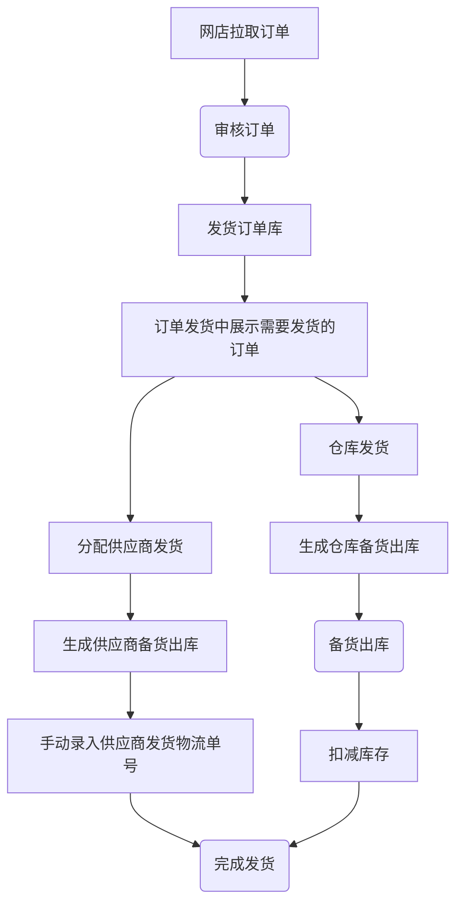
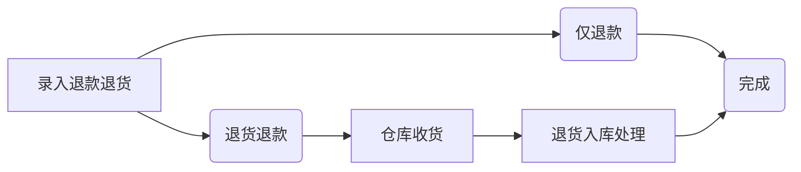
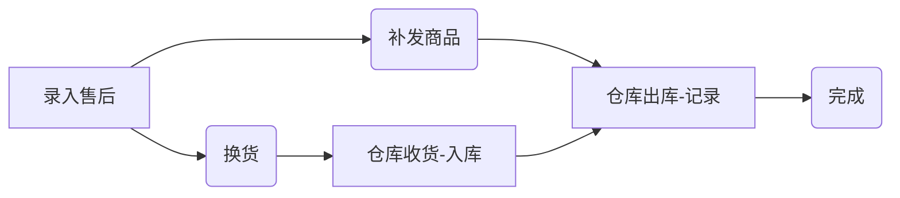
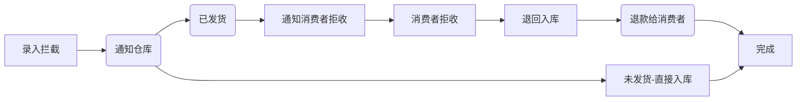

# 启航电商OMS系统2.0版
> **欢迎来到我们的开源项目！创新、协作、高质量的代码。您的Star🌟，是我们前进的动力！ 💪✨🏆**

> **项目持续更新中，还有很多不足，请多包含！如有任何疑问请提交issuse！谢谢！ 💪✨🏆**

## 一、系统介绍
启航电商OMS系统2.0版本是一个完整开箱即用的开源电商OMS系统，经历1.0版本的迭代优化和客户使用验证。开发者可以直接部署即可使用。

启航电商OMS系统是一个专注核心订单处理业务，主体功能包括：商品管理、店铺商品管理、订单库、店铺订单管理、发货管理（支持仓库发货、供应商发货）、售后管理、库存管理等。

与此同时该系统会陆续增加供外部调用的API，以便开发者满足自己的个性化业务需求。

启航电商ERP系统支持：淘宝天猫、京东、拼多多、抖店、微信小店等平台，后续将继续对接其他电商平台。


## 二、主体功能

主体功能包括：
+ 商品管理：商品库管理、店铺商品管理（拉取店铺商品、ERP关联）。
+ 订单管理：店铺订单同步、管理。
+ 发货管理：电子面单打印、发货记录、物流跟踪等。
+ 售后管理：店铺售后同步、售后处理（补发、换货、退货处理）等。
+ 店铺&平台参数设置：店铺管理、平台参数设置。

**基本上覆盖了电商网店管理日常业务，可使用接口对接内部ERP系统。**

**订单打单（电子面单打印）已支持：淘宝、京东、拼多多、抖店、微信小店**


## 三、功能模块

#### 1、商品管理
+ 商品库：管理商品库商品，提供手动录入、API接收功能，可以设置自己发货还是供应商发货（影响到后台分单逻辑，即时生效）。
  + 商品Sku：查看所有商品库SKU
+ 库存管理：支持手动修改库存（备货出库之后会扣减库存）
+ 店铺商品：店铺商品管理，店铺商品API拉取、店铺商品API更新（进行店铺商品与商品库商品关联，根据SKU编码关联）。
+ 分类管理：分类及分类属性管理（规格属性是用来组合Sku的）
+ 品牌管理
+ 供应商管理


#### 2、订单管理
+ 发货订单库：需要发货的订单查询，发货订单明细查询。
+ 店铺订单管理：订单API拉取、订单API更新、订单确认（确认之后订单进入发货订单库）等，支持淘宝天猫、京东、拼多多、抖店、微信小店。
+ 订单拉取日志：记录店铺订单每次拉取日志。，


#### 3、发货管理
+ 订单发货：处理待发货的订单，支持手动发货、分配给供应商发货。
  + 手动发货：手动填写物流单号进行发货，手动发货之后将进入备货出库中。
  + 供应商发货：分配给供应商发货，分配之后将进入备货出库中；

+ 电子面单发货：支持快递打印、发货、补单等功能，开源版暂时不支持。
+ 备货出库：已发货、已分配给供应商发货、电子面单打印快递单完成都会加入备货清单，提供给仓库备货查询。备货单可以生成出库单。
  + 供应商备货支持手动填写物流单号，实现发货。
  + 仓库备货出库：备货出库之后将扣减库存。
+ 发货记录：发货记录，提供手动发货功能。
+ 发货设置：设置发货快递、电子面单账户等信息
  + 快递公司管理：管理发货的快递公司（支持从平台拉取、支持手动添加）。
  + 电子面单账户设置：管理店铺开通的电子面单账户


#### 4、售后管理
+ 售后中心：聚合售后查询、详情、管理。
+ 店铺售后管理：售后API拉取、售后API更新、手动推送、售后操作（同意、备注）。
+ 售后处理记录：售后处理的记录查询，提供手动售后处理功能。


#### 5、店铺&平台设置
+ 店铺管理
+ 平台开关


## 四、主要流程


### 1 发货流程


**订单发货流程**



### 2 售后处理流程

**退货退款流程**


**售后流程**



**订单拦截**



## 五、部署说明

#### 0 版本说明
+ Java：17
+ Nodejs：v16
+ SpringBoot:3
+ MySQL:8
+ Redis:7

#### 1 配置MySQL

+ 创建数据库`qihang-oms`
+ 导入数据库结构：sql脚本`docs\qihang-oms.sql`


#### 2 启动Redis


#### 3 修改项目配置

+ 修改`api`项目中的配置文件`application.yml`配置`Mysql`相关配置。


#### 4 mvn打包部署
+ Java版本：`Java 17`
+ Maven版本：`3.8`
  `mvn clean package`


#### 5 前端 `vue`打包
+ nodejs版本要求：`v16.x`
+ 安装依赖：`npm install --registry=https://registry.npmmirror.com`
+ 打包`npm run build:prod`

#### 6 修改Nginx配置

```
# 前端web配置
location / {
        #root   /opt/qihangerp/nginx/dist;
        root /usr/share/nginx/html;
        index  index.html index.htm;
        try_files $uri $uri/ /index.html;
    }
# 增加后台api转发
=======
##### 修改Nginx配置（增加vue404、增加后台api转发）

location /prod-api/ {
    proxy_set_header Host $http_host;
    proxy_set_header X-Real-IP $remote_addr;
    proxy_set_header REMOTE-HOST $remote_addr;
    proxy_set_header X-Forwarded-For $proxy_add_x_forwarded_for;
    proxy_pass http://localhost:8086/;
}
```
#### 7 访问web
+ 访问地址：`http://localhost`
+ 登录名：`admin`
+ 登录密码：`admin123`


---

##### 💡 如果不想自己折腾？

* **没有技术团队？** 启航电商ERP商业版提供一键部署 + 7x24小时技术支持
* **申请不到 AppKey？** 商业版除了支持电商开放平台AppKey之外还集成了第三方API接口（使用第三方API无需自行申请Appkey）
* **需要更多功能？** 商业版支持多商户、多仓库、AI智能分析

👉 **[启航电商ERP商业版帮助文档](https://gitee.com/qiliping/qihangerp-docs)** |

---

## 📦 启航电商开源生态

启航电商旗下开源项目矩阵，所有项目共同指向统一商业版：

| 项目                                                         | 定位 | Gitee | GitHub |
|:-----------------------------------------------------------|:----|:-----|:-------|
| [启航电商ERP](https://gitee.com/qiliping/qihang-ecom-erp-open) | 电商业务中台底座（微服务） | [Gitee](https://gitee.com/qiliping/qihang-ecom-erp-open) | [GitHub](https://github.com/zeasin/qihang-ecom-erp-open) |
| **OMS 订单中台 ⬅**                                             | **轻量级订单管理** | [Gitee](https://gitee.com/qiliping/qihang-oms) | [GitHub](https://github.com/zeasin/qihang-ecom-oms) |
| [跨境云仓WMS](https://gitee.com/qiliping/qihang-cloud-wms)     | 专为跨境云仓服务商打造 > 智能仓配，高效管理，一键无忧。 | [Gitee](https://gitee.com/qiliping/qihang-cloud-wms) | [GitHub](https://github.com/zeasin/qihang-cloud-wms) |
| [跨境ERP](https://gitee.com/qiliping/qihang-cb-erp)          | 跨境电商 | [Gitee](https://gitee.com/qiliping/qihang-cb-erp) | [GitHub](https://github.com/zeasin/qihang-cb-erp) |
| [SCM 供应链](https://gitee.com/qiliping/qihangerp-scm)        | 多商户多供应商系统（已合并到商业版） | [Gitee](https://gitee.com/qiliping/qihangerp-scm) | [GitHub](https://github.com/zeasin/qihangerp-scm) |

## 💼 商业版

👉 **[启航电商ERP商业版功能预览](https://gitee.com/qiliping/qihangerp-docs)**

👉 **了解更多？→** 电话/微信：15818590119


## 📱 关注我们

|                   公众号：启航电商ERP                   |                   个人号：码农老齐                   |
|:-----------------------------------------------:|:--------------------------------------------:|
|                 产品动态·行业方案·客户案例                  |                技术实战·开源故事·创业心得                |
|  |  |


**感谢关注！我希望将从事电商 10 余年的行业经验沉淀在代码中，帮助大家真正提升经营效率。**

💖 如果项目对您有帮助，请点个 **Star ⭐** 给予鼓励！


---

## ☕ 捐助作者

如果这个项目对您有用，欢迎请作者吃个盒饭，您的支持是项目持续更新的动力！

|                      微信支付                       |                     支付宝                      |
|:-----------------------------------------------:|:--------------------------------------------:|
|                   捐赠随意，捐赠进交流群                   |                捐赠随意，捐赠进交流群                |
|  |  |


